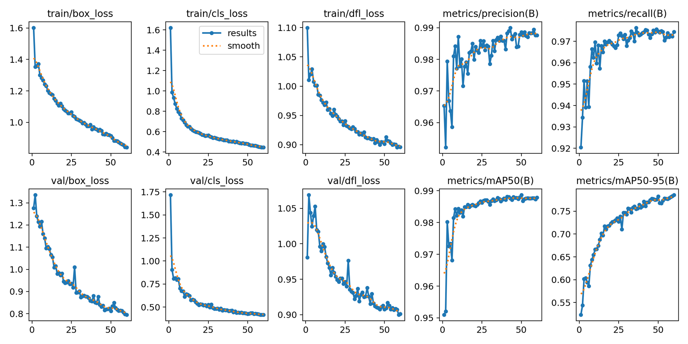
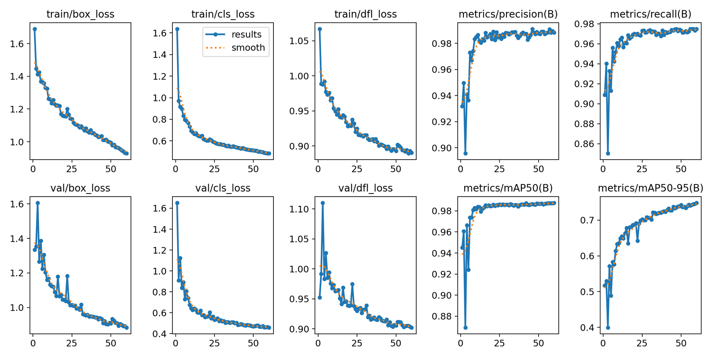
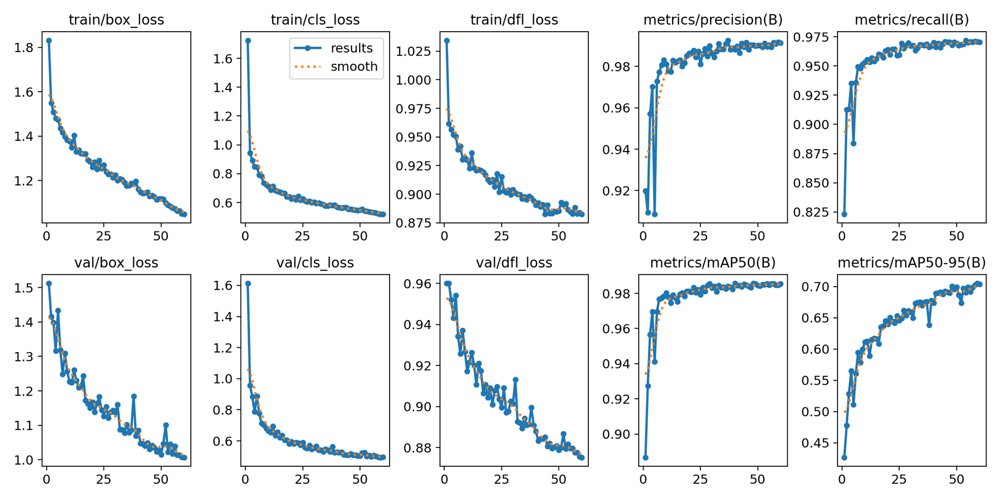
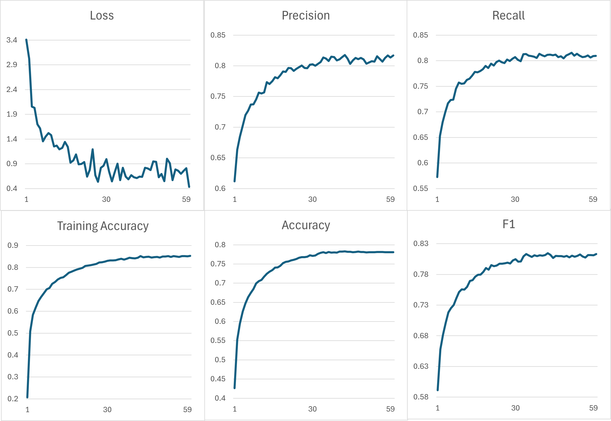
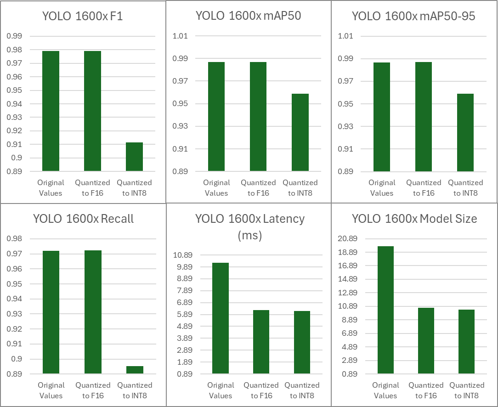
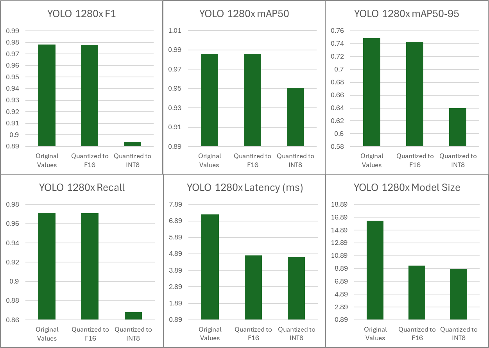
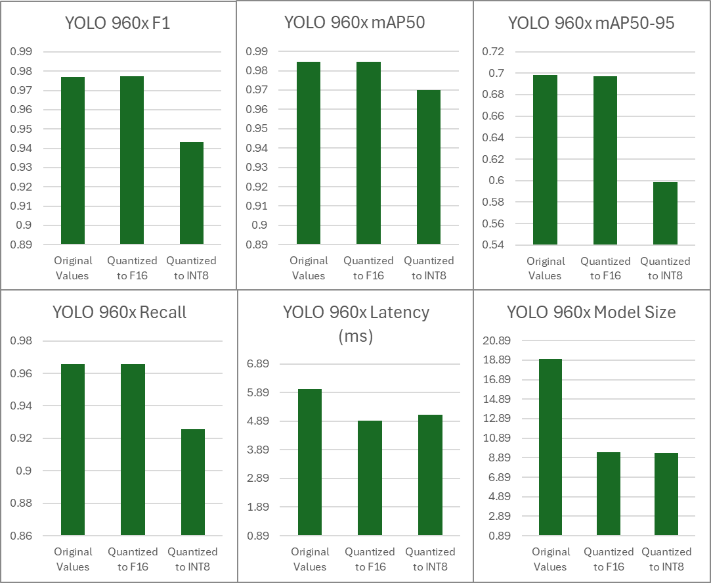
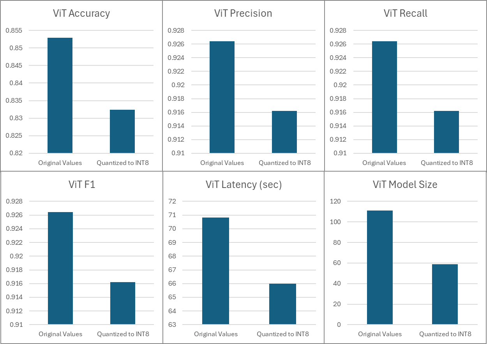

# Nachet Quantization Report

University of Manitoba - COMP 4560 Industry Project Course

Roman Tebel

Shaun Paraplammoottil


## Abstract
This project explores the effects of quantization on models similar to those being used in Nachet as of January 2025. As a university student team, we could not use the exact same models and datasets that were utilized by the CFIA AI lab, but despite that - the quantization process can still be useful. Through our work, we fond that dynamic quantization is the most optimal approach for both YOLO and Swin ViT models in terms of effort to performance gain ratio. With our setup, we ended up halving the size of the ViT, gaining a 6.8% boost in inference time, and maintaining an accuracy that is 2-3% less than the original.

## 1 Introduction
This section will cover some of the concepts that are used in this project. While this is all surface-level knowledge, one may find good pointers in case they need to quantize anything in Pytorch themselves.

### 1.1 Purpose
The student team from the University of Manitoba was tasked with putting together a set of models that is similar to what the AI lab at the CFIA is using. After the models are hypertuned, the team was to quantize them and document their observations.

### 1.2 Quantization
Quantization, in the context of large AI models, refers to a mapping of float 32-bit values to 8-bit integers. For a given range of float values, a scaling factor is derived from the difference between the maximum and the minimum floats in that range. This scaling factor is then used to map all float values between the minimum and the maximum floats to integers. The scaling factor is saved to dequantize integer values later as needed. Quantization is generally divided into 3 techniques:
1. Dynamic

	Dynamic quantization makes it so that the model recalculates all the scaling factors for weights and activation functions at runtime. This maintains the highest accuracy, but adds additional operations for inference which may cancel out the performance gains with extremely big models. The specific procedure actually gets scaling factors for weights only once, as weights do not change during inference. Activation value scaling factors, however, get recalculated at runtime.
2. Static

	Static quantization computes the scaling factors once and then keeps them with the model without changing them at runtime. Pytorch attaches observers for weights and activation values for specified modules through quantization configs. These observers will later be used to derive best scaling factors. In this case, it is crucial that the model gets fed some test data that it would typically see during inference to expose the observers to a realistic distribution of values. While the model will not recalculate all the scaling factors at runtime here, it will blow up if it processes data that is different from what its observers saw during calibration. You will typically find that people like to use Pytorch's FX mode to perform static quantization.
3. Quantization-Aware Training (QAT)

	This approach tends to speed up training and is intended to compute scaling factors that will not change at runtime. Unlike static quantization, this tends to maintain accuracy and is less prone to explosions when new, unseen data is introduced to the model. We did not employ QAT during this project as we used the smallest variants of YOLO and Swin ViT - our machines and the University's A40 GPU was sufficient to train the models.

Diving deeper, one needs to also consider the backend for quantization, as certain hardware will tend to perform quantized operations differently depending on its architecture. From our research, the two main backends to consider are FBGEMM for x86 CPUs and QNNPACK for ARM CPUs. At the moment of writing this report, Pytorch is capable of automatically detecting the necessary backend for whatever machine is running the model, so this should not be an issue. **One interesting area to look into, however, would be how different backends perform quantized operations and if there is a way to optimize them further for a specific CPU.**

Another interesting observation is that computed scaling factors remain with the model as metadata in case values need to be dequantized at any point during inference. This is likely the reason as to why we only observed quantized models getting halved in size even though most of their parameters are getting converted to int8 - values that are 4 times smaller than float32. At a quick glance at all the model parameters post-quantization, most scaling factors were actually stored as float64 values. We think this explains why models don't their size quartered.

### 1.3 Pytorch Quantization Process
Pytorch offers 3 quantization approaches:
1. Eager mode
   
	This is the most manual approach, where the developer needs to go through each module in the model and add additional functions that will be used to later quantize the model. This is helpful when one would need to define exactly how the model needs to behave post quantization, but this will also require a lot of time to set up. We did not use this procedure, but you may see something similar to this in our dynamic quantization for the ViT.
2. FX mode
   
	This is by far the easiest way to optimize models through static quantization or performing quantization-aware training. FX mode requires one to attach weight and activation observers to modules in a quantization configuration mapping. The idea behind the observers is to capture weights and activation values throughout the model and come up with scaling factors for them. It is crucial that observers derive the average scaling factors based on data that a model would typically encounter during its operation in the real world. Extremely different data inputs cause the accuracy to decrease dramatically. FX mode also allows one to interact with the model through a graph representation of all modules contained in the model. By feeding the model some random-generated noise, Pytorch can perform symbolic tracing to generate the graph. Nodes in this graph can be swapped out on demand.

	We managed to successfuly fuse some modules in the ViT such as ReLU and Linear, which got rid of redundant dequantization during inference. In our code for static quantization, the key aspect is the calibration of observers prior to fully converting the model with FX mode. This lets Pytorch's runtime know to treat the quantized model and its observers as if it was quantized statically.
3. Export mode
   
	At the moment of writing this final report, this mode is still in early development, but a very good implementation of it can be seen in the ultralytics library that is used for one of the models in this project. This mode would automatically quantize models with a few lines of code once it is ready.

## 2 Setup
This section will cover the libraries, models and datasets that we used to implement this project. We did not follow a specific template for organizing this project, but the main sections to inspect are the data, scripts and the main directories. 

The data directory is not complete as git will not allow large uploads beyond 100 MBs and our datasets exceeded 15 GBs. Instead, you will find the dataset of seeds and our large resolution backgrounds that are used for creating synthetic data.

The scripts directory contains all the python files that we used for manipulating data, removing seed backgrounds, etc. These are all files that one can just execute after tweaking some internal variables.

The main directory contains the Pipeline Python file. This serves as the main function of the program and is intended to be rewritten based on work that needs to be done. In this directory you will also find classes that can be used for various tasks.
1. **Analytics Module** - this provides some useful functions for evaluating model performance, checking size and counting specific parameter types.
2. **Classification Dataset** - this is a custom dataset class to work with the synthetic classification data. We cropped out seeds from large synthetic images that we made - this is what the ViT was trained on. Note that this dataset can't use multiple workers at the moment - some additional reformatting is needed to make multithreading work.
3. **Classifier Trainer** - this class will take care of training the ViT. Instantiate this class in the pipeline with the classification model that you want to train and call the trainer's train method.
4. **Data Loading Station** - this station contains methods that are used to create Pytorch dataloaders for the ViT. It also has a method to get dataloaders for the YOLO, but it's much simpler to use the YOLO with its YAML-formatted data. The typical pipeline should start with an instance of this class, and the loading of classification data (usually for the sake of getting a dictionary of all classes and their indices).
5. **Detection Dataset** - this is a custom dataset class to work with YOLO from ultralytics. It is not used at the moment, but one may use this class to begin working towards making YOLO work with anything other than YAML-labelled data.
6. **File Mover** - this contains a helper method for the pipeline to work with quantized YOLO models.
7. **Inference Station** - this contains a few methods for inference that may use one or both models. Generally, we use the inferOnCombined method to draw the boxes and class predictions on images. We recommend that you start by taking that method apart if you want to look at how specific parts of inference work.
8. **Model Loading Station** - this class takes care of loading and saving models in their respective directories. The methods in there are self-explanatory but they were all made to get rid of looking up directories for models throughout the pipeline.
9. **Pipeline** - this is the main method, we load up all of our stations in here as we need them and call their methods throughout inference, training and quantization.
10. **Quant Station** - this is where all of our quantization methods are contained. You will find a couple of ways that we tried to statically quantize the ViT - neither of them works well. Your main attention should be driven to the dynamic quantization method, where we create a qconfig for Linear and Conv2D modules and then attach it to every applicable module in the entire model. This is tedious, but allows for great control.

### 2.1  Code Examples
Below you may find some examples of how we would setup the Pipeline file. In hindsight, there were better way to do this, but it was difficult to tell the direction in which this project would develop. 
```
#Training pipeline
print("Starting pipeline")

print("Loading data")
dls = DataLoadingStation()
dls.load_data_classification(0.95, 0.05)
dls.load_data_detection(0.8, 0.05, 0.15)

mls = ModelLoadingStation()
mls.load_new_classification_model()
mls.load_new_detection_standard_model()

print("Training")
ts = TrainingStation(mls.cur_detection_model, mls.cur_classification_model)
ts.trainClassification(dls.dl_train_classification, dls.dl_validate_classification, dls.dl_test_classification, dls.num_classes)
ts.trainDetection()

print("Pipeline finished")
```

```
#Inference pipeline
print("Starting pipeline")

print("looking for input image")
dls = DataLoadingStation()
dls.load_data_classification(0.95, 0.05)# this is needed just to get the indexe classes

mls = ModelLoadingStation()
mls.load_saved_classification_model(2) #second ViT model is vit2.pt
mls.load_saved_detection_model(5)# fifth YOLO is yolo11n5.pt
   
print("Running inference")
inferS = InferenceStation()
inferS.inferOnCombined("data/syntheticForTest/images/test/image6065345_2.jpg", mls.cur_detection_model, mls.cur_classification_model, dls, "testForLabels3.jpg")

inferS.inferOnDetection("testInput.jpg", mls.cur_detection_model)

print(inferS.inferOnClassification(io.decode_image("testInput.jpg", mode="RGB"), mls.cur_classification_model, dls))

inferS.evaluateCombined("data/syntheticData", mls.cur_detection_model, mls.cur_classification_model, dls)

print("Pipeline finished")
```

```
#Quantization pipeline ViT
print("Starting pipeline")

dls = DataLoadingStation()
dls.load_data_classification(0.95, 0.05)

mls = ModelLoadingStation()
mls.load_saved_classification_model()

check_stats_classification(mls.cur_classification_model, dls, inferS, "cpu")
check_stats_classification(mls.cur_classification_model, dls, inferS, "cuda")

print("Quantizing")
quantS = QuantStation(dls, inferS)
print_size_of_model(mls.cur_classification_model)

quantized_int8 = quantS.dynamic_quant_class(torch.qint8,model = mls.load_retrieve_saved_class_model())
print_size_of_model(quantized_int8)
check_stats_classification(quantized_int8, dls, inferS, "cpu")


quantS.static_quant_class(model = quantized_f16, dls = dls,  dtype_incoming = torch.float16)#This will not work well
print_size_of_model(quantized_f16)
check_stats_classification(quantized_f16, dls, inferS, "cuda")

print("Pipeline finished")
```

```
#Quantization YOLO
print("Starting pipeline")

dls = DataLoadingStation()
dls.load_data_classification(0.95, 0.05)

mls = ModelLoadingStation()
mls.load_saved_detection_model(2)


print("\nExporting")
export_dir = "models/detection/quantization"

print("EXPORTING FULL PRECISION")
# FP32 Export (Full Precision)
mls.cur_detection_model.export(format="engine")
logInfo = find_and_move_file("models/detection/", "models/detection/quantization", "yolo11n1.engine", "ModelFp32.engine")
print(logInfo)

print("EXPORTING HALF PRECISION")
# FP16 Export (Half Precision)
mls.cur_detection_model.export(format="engine", half=True)
logInfo = find_and_move_file("models/detection/", "models/detection/quantization", "yolo11n1.engine", "ModelFp16.engine")
print(logInfo)

print("EXPORTING QUANTIZED")
# INT8 Export (Quantized)
mls.cur_detection_model.export(format="engine", int8=True, data = "data/syntheticData/data.yaml")
logInfo = find_and_move_file("models/detection/", "models/detection/quantization", "yolo11n1.engine", "ModelInt8.engine")
print(logInfo)

print("\nCOMPARING METRICS")
check_stats_detection("models/detection/quantization/ModelFp32.engine", "Fp32 Model")
check_stats_detection("models/detection/quantization/ModelFp16.engine", "Fp16 Model")
check_stats_detection("models/detection/quantization/ModelInt8.engine", "Int8 Model")

print("Pipeline finished")
```
### 2.2  Models
For detecting seeds, we used the YOLO v11 nano from ultralytics. This model comes with the ultralytics library, as well as lot of ease-of-life features. Initially we trained this model on a dataset that later became irrelevant to the project, so we instead made a lot of synthetic data that was used for training YOLO models. We have trained 3 YOLOs on resolutions of 1600x1600, 1280x1280 and 960x960. You may find graphs for all of them below:

1600x1600 YOLO v11 nano

1280x1280 YOLO v11 nano

960x960 YOLO v11 nano

For classification, we used the Swin ViT V2 from torchvision. We hypertuned and quantized the tiny variant that contains 28.5 million parameters. Below you may find the training metrics for it.

We reached an accuracy of 78% during training, but it averaged out to about 85% throughout inference trials and went up as high as 89%. The gap of about 6% between training and test accuracies indicates that the model generalizes decently well, and bigger ViTs could reach better accuracy as they would be able to fit training data better.

### 2.3 Datasets
We came across a research paper that produced a dataset which contains 88 classes. These pictures are not the best quality, and certain classes are underrepresented in the original dataset. We made the backgrounds of each seed image transparent and implemented an algorithm that would generate synthetic data. The algorithm can be found in the DataGenerator class in the scripts directory. 
The algorithm has the following steps:
1. Choose a random UHD resolution.
2. Choose a random background and crop it to match the resolution.
3. Choose a random number of seeds to place in the image.
4. For every seed that is to be pasted, randomly rotate the seed and its box label.
5. Store the seed class and box labels in YAML format.

During validation on synthetic data with both models working together, the YOLO will ignore the class labels for every box - they will only be used by the classifier.

### 2.4 Libraries and Tools
A list of libraries needed to run this can be found in the requirements text file. A standard set of libraries like torch and torchvision were used to implement this project. We would like to highlight the ultralytics library here as it comes with powerful engines for inference, training and quantization. It is extremely easy to use, but may lack flexibility that's needed to apply ultralytics functions to models outside of their library. Note that for quantization, ultralytics supports export of Pytorch models, but only does so for specific formats. To perform inference (not just validation) with a quantized YOLO in this project, the TensorRT runtime needs to be configured.

## 3 Results
All the raw data is contained in a spreadsheet in the same directory as this report. Note that there is randomness present in the evaluation of certain metrics. Latency represents the inference time for models, and is measured in seconds. Model size is measured in megabytes.

YOLO 1600x1600 training resolution:


YOLO 1280x1280 training resolution:


YOLO 960x960 training resolution:


ViT:

Note that ViT Latency was only tested on the CPU, as int8 quantization does not function well with CUDA. We ensured to double check the latency reduction by quantizing first, before checking model metrics. Latency was reduced regardless of order of operations, meaning that the small boost in performance does not come from caching model data - these are actual enhancements.
## 4 Discussion
The ultralytics library comes with very good support for quantization, so we were able to capture how conversion to float16 and int8 affects YOLO models trained on various resolutions of images. Quantization here goes as far as just exporting the model in a specific format with either half-precision or int8 conversion. 

If one were to dig into the code for the export function in ultralytics, it seems to do static quantization in the case of int8 conversion as there is a calibration segment where data is fed into the model with observers attached. In the case of half-precision, the export function simply calls the half() method on the model, before saving its weights along with all the metadata.

The half() function is native to Pytorch and it casts all accessible float32 parameters to float16. This is sometimes unsafe as can be seen in the case of the ViT. The model's state dictionary will be largely affected by float16 conversion this way, without having much effect on anything else. 

This approach does not work for the ViT - the transformer gets a lot of benefits from dynamic quantization to int8, but calling half() on it fails internal assertions. Pytorch comes with a mixed precision submodule which tries to apply half() during inference whenever it is safe to do so for certain parameters. This seems to have no effect on the ViT - converting any significant portion of it to float16 tends to break the model.


## 5 Future Exploration Points
- One could explore quantization for the YOLO model using standard Pytorch methods, similar to what is applied to the ViT. YOLO is a bit less complex in its architecture so the usage of FX mode and even static quantization could work here very well.
- While we looked at how different resolutions affect the YOLO, we still only used small variants of each model. Applying the quantization techniques in our project to larger models can provide more interesting results in regards to performance.
- An interesting point for experimentation would also be the usage of different quantization engines, such as the one for ARM CPUs.


## 6 References

Dataset of 88 classes of plant seeds:
https://www.nature.com/articles/s41597-024-03176-5#Sec7

YOLO model and its library:
https://docs.ultralytics.com

Pytoch Swin ViT:
https://pytorch.org/vision/main/models/swin_transformer.html


